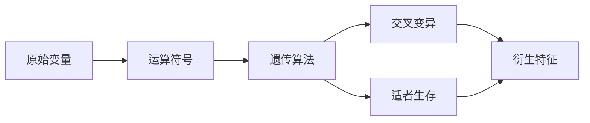

# 0327笔记

## 使用 `mermaid` 来构建流程图

@import "./image/遗传算法图例.png"

[解决宋婧的问题](http://scikit-learn.org/stable/auto_examples/plot_digits_pipe.html#sphx-glr-auto-examples-plot-digits-pipe-py)
[python时间序列问题](https://www.cnblogs.com/foley/p/5582358.html)
[Python中利用LSTM模型进行时间序列预测分析](https://www.cnblogs.com/arkenstone/p/5794063.html)

np.nan为真

在pypi里搜索 xgboost 看到的模块
@import "./image/xgboost搜索_20180328115910.png"